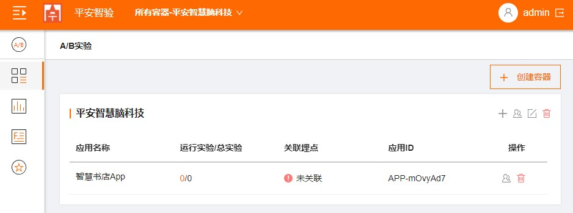

## 容器及应用设置

### 创建容器

  1. 登录到 https://smartest-test.pingan.com/ ,进入AB测试的的主界面；
  2. 点击《创建容器》；
  3. 输入一个容器名称；
  4. 点击《确定》完成容器创建；
  
  > 注：容器可以理解为一个项目空间，可以创建多个容器，一个容器下可以创建多个应用。

  

### 创建应用
  1. 点击容器面板上的创建应用；
  
  
  
  2. 输入一个应用名称；
  
  

  3. 点击《确定》完成应用创建；

  

  4. 点击刚刚创建的应用，进入到应用；

  

  5. 点击右上角的《应用设置》
  
  6. 在应用设置页面，下拉关联天眼埋点；

  
   
  
  
  > 注：“应用”通常用于管理一个APP或网站之上的试验，当然对于比较大的APP/网站或者比较复杂的试验情况，也可以分为多个应用来组织和管理。对于独立的H5推广活动页面，您也可以选择在同一个应用中进行管理。每个应用对应一个appKey，用于集成SDK。
  
   
  
   
   
  
    
   
   

