## 功能标志(Feature Flag)

   功能标志（也称为功能切换）是一种软件开发技术，可让您在不部署新代码的情况下打开和关闭某些功能。标志允许更好地控制功能的整个生命周期。您可以关闭某个功能以快速发布代码，而无需将其公开给用户。您还可以将其推广到一小部分用户群，以最大限度地减少发布的影响，从而允许您在广泛推出之前验证功能并衡量性能。

### 步骤1：创建标志
    
   1. 点击左侧导航树上“Feature管理”，切换到Feature管理页面；
   
   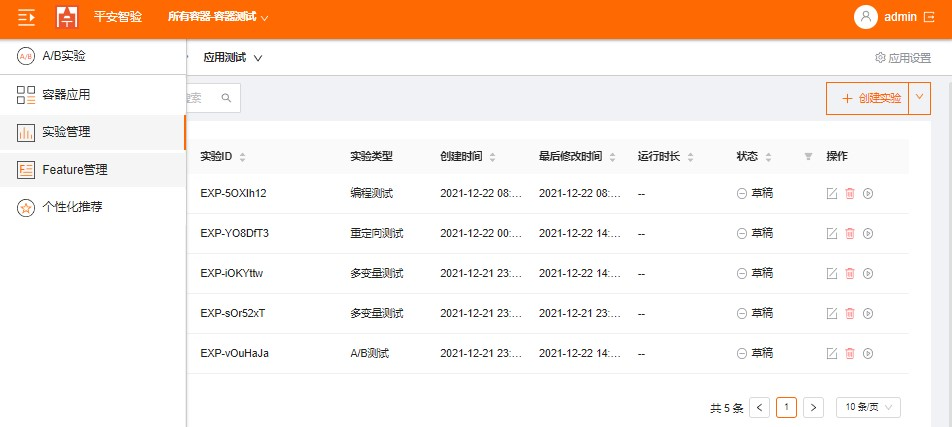
   
   2. 点击页面右侧的"创建Feature”按钮，输入Feature名称、Feature描述；
   
   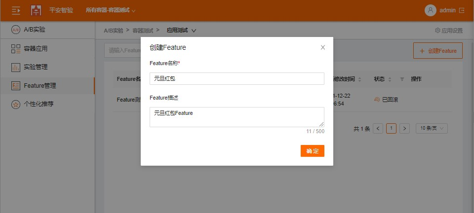
   
   3. 点击"增加参数",增加Feature Flag参数，设置参数类型、参数名及默认值；
   
   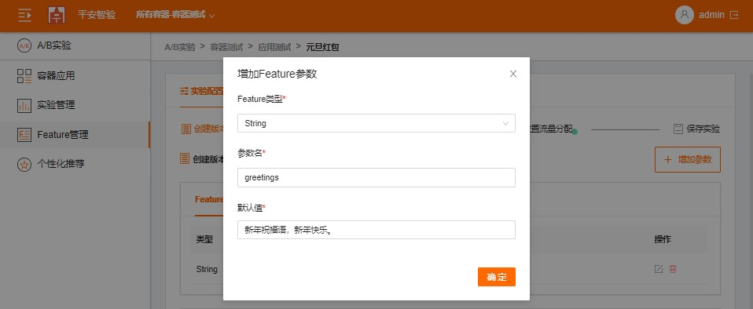
   
   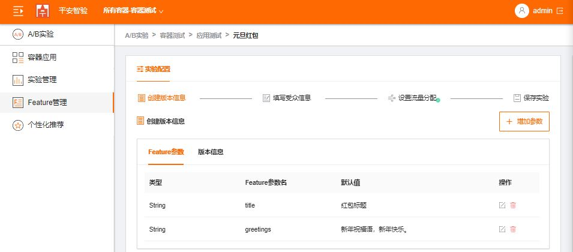
   
   4. 切换到版本信息页面，点击"增加变体“，输入变体名；

   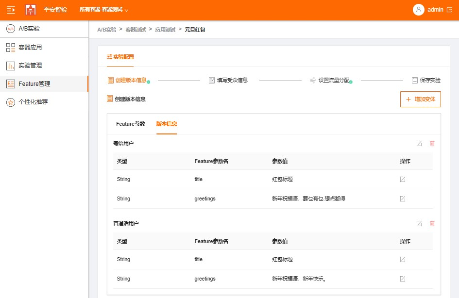
    
   5. 点击”编辑Feature参数“，修改Feature参数；
    
   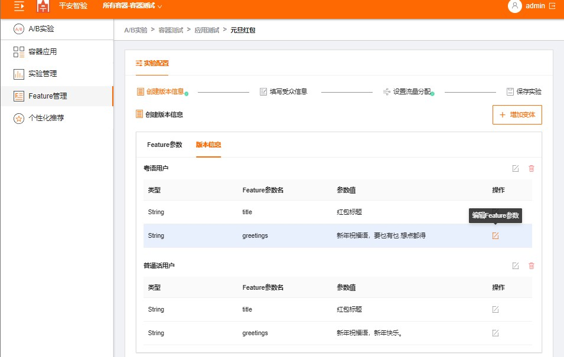
   
   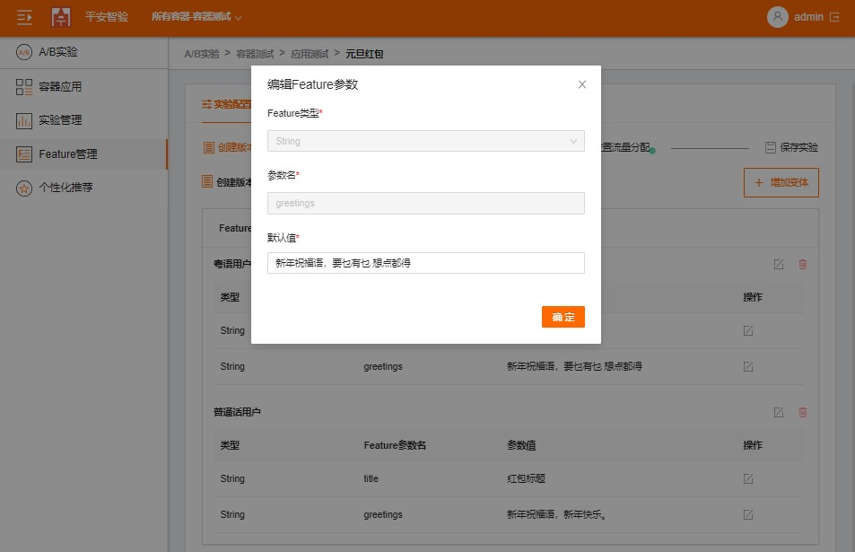
   
   6. 定义每个变体的发布范围及默认发布范围，点击添加发布范围，输入范围及受众规则；
    
   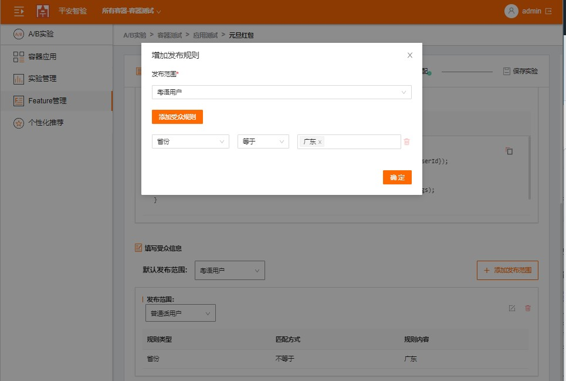
    
   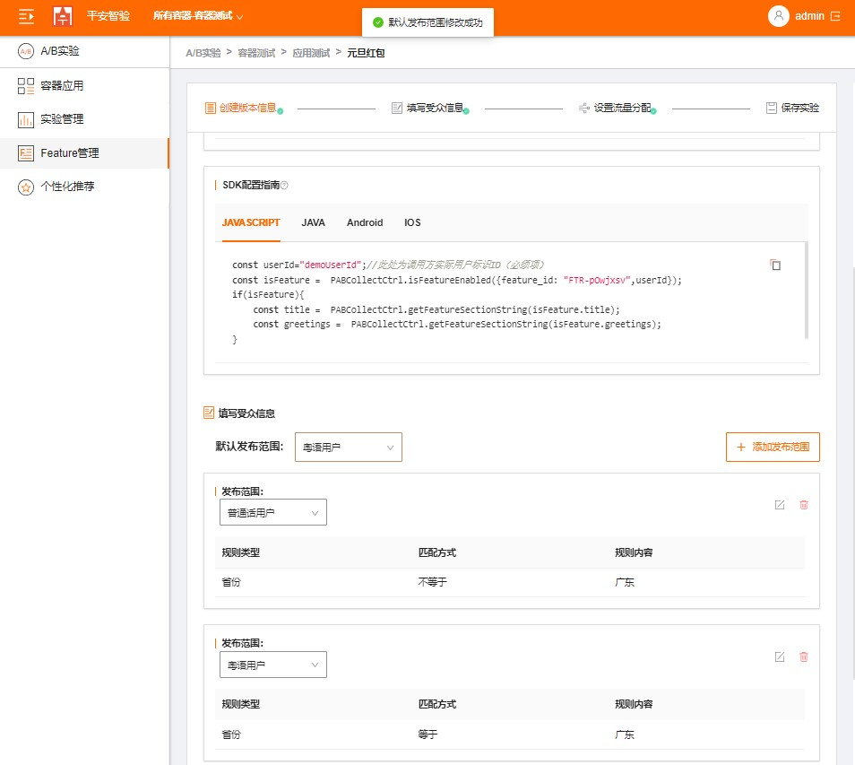
    
   7. 设置目标受众比例；
    
   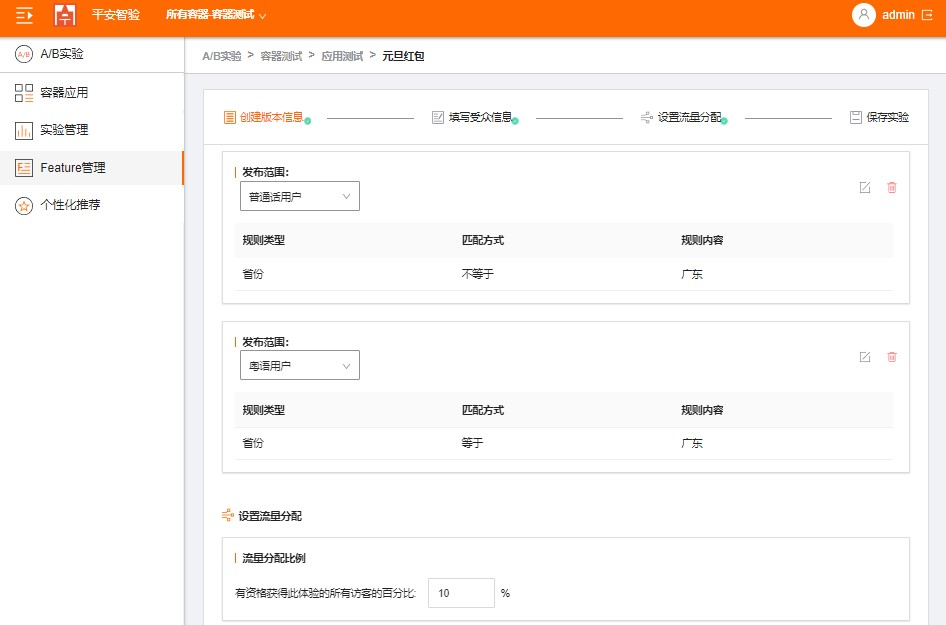
    
   > 发布的流量比例范围为0.01%到100%。

### 步骤2：实现功能标志

   参考样例代码，实现功能标志；
           
### 步骤3： 发布Feature

   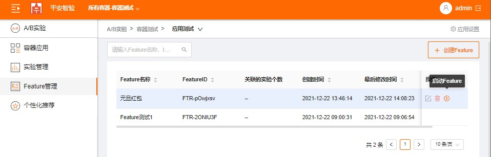
    
### 步骤4： 调整发布流量调整及回滚

   1. 修改流量分配比例，可以调整发布的流量；
   
   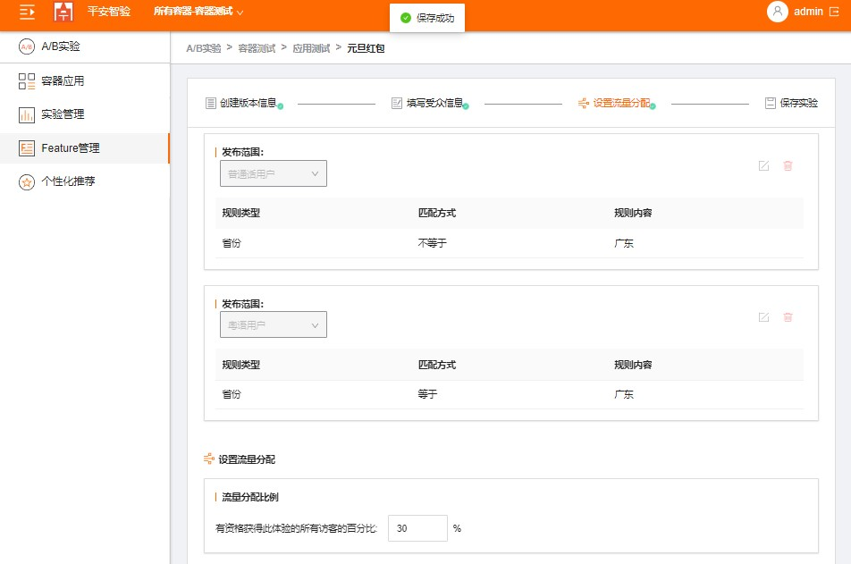
   
   2. 发布后也点击”Feature回滚“实现Feature回滚；

   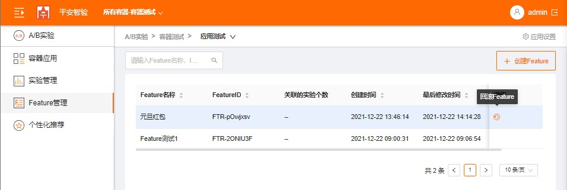
    
   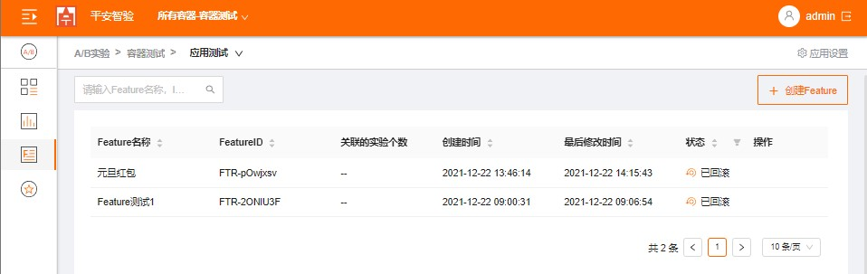

