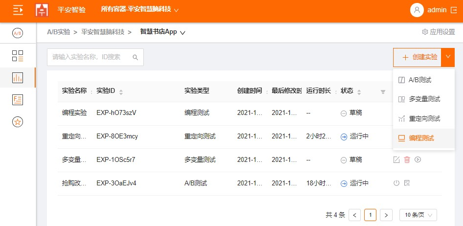
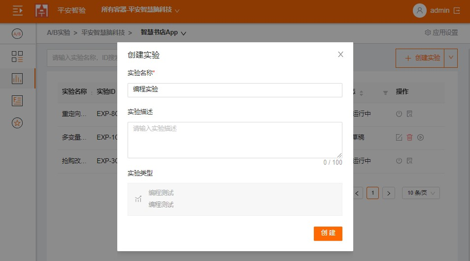
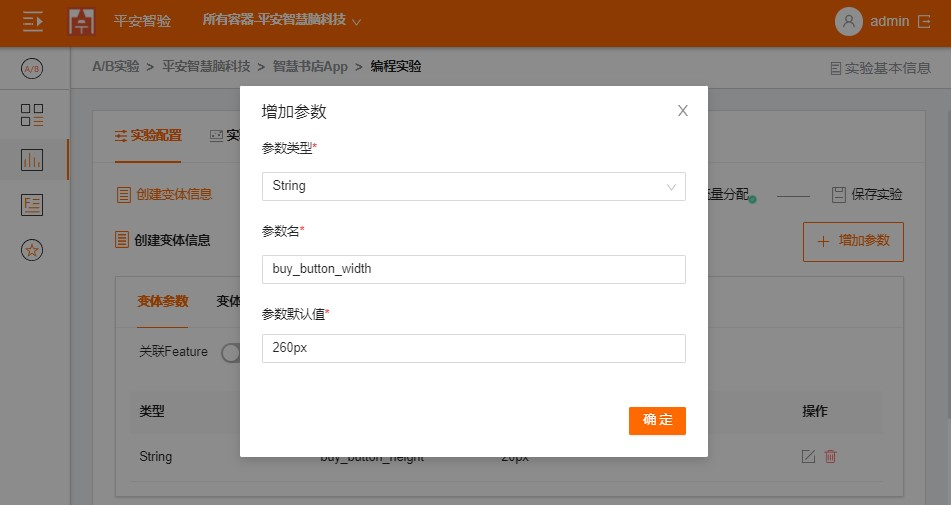
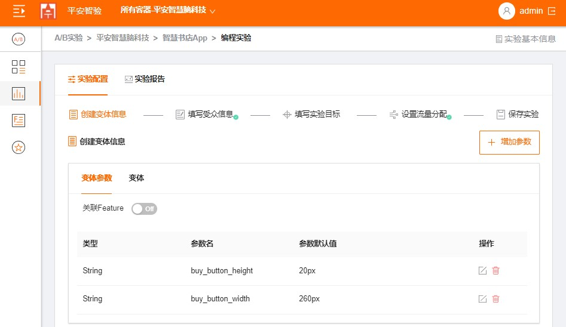
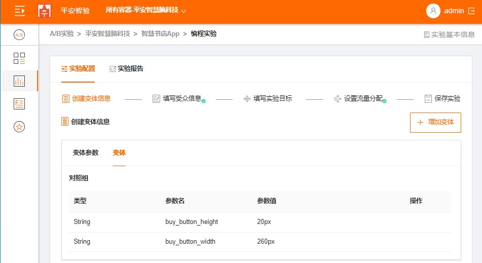
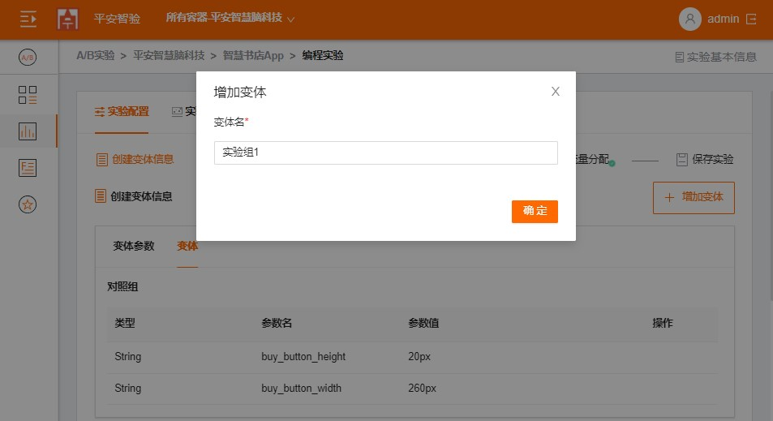
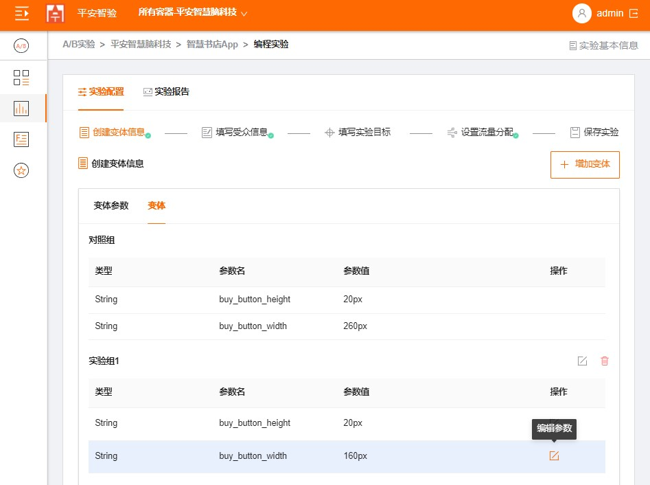
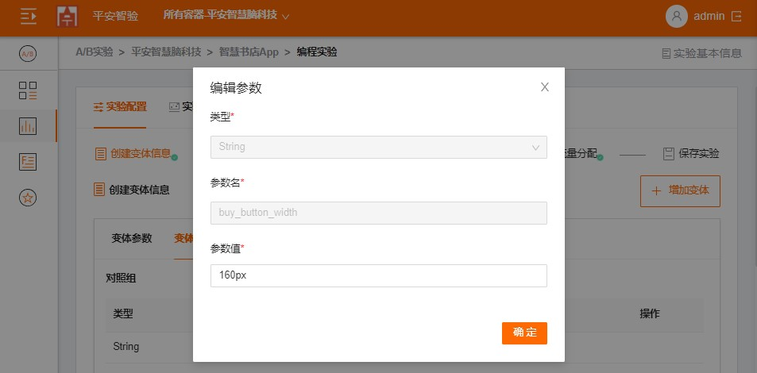
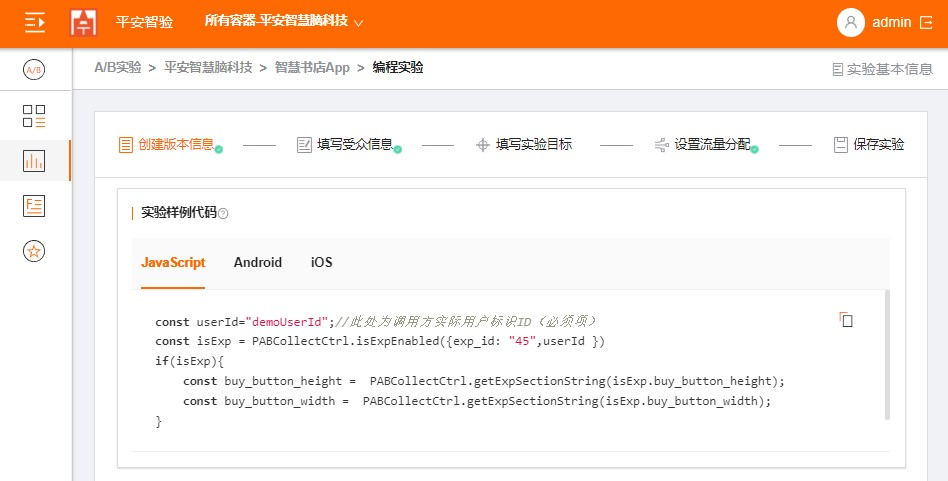

## Full Stack：创建编程测试

### 步骤1：点击应用名称，然后点击“创建实验”，下拉选择编程测试
  
  
  
### 步骤2：填写实验名称，实验网页的URL，填写完成后，点击“创建“。

  
  
### 步骤3：制作应用或网站的变体

   1. 点击“增加参数”。填写变体的参数名及默认值，然后单击“确定”。
     
   
   
   

   2. 根据需要重复上述步骤。
   
   3. 点击“变体”，切换到变体页；
   
   

   4. 点击“增加变体”，输入变体名，点击“确定”；
   
   

   5. 点击“编辑参数”，修改参数值;

   
   
   
   
   6. 根据需要重复上述步骤；

   7. 参考示例代码，开发实现应用或网站变体；

    
   
### 步骤4：定位受众群体。

   1. 点击“添加受众规则”。
     
   
     
   2. 选择定位受众的规则，可以从设备，屏幕大小等定位。可以选择多个规则。
     
   

   

### 步骤5：设定实验目标
    
   1. 点击“添加主要指标”，设置指标名称，设置指标及计算公式;

   
    
   2. 点击“添加主要指标”，设置指标名称，设置指标及计算公式;

   
      
   >  总共可以设置两类实验目标，主要指标及附加指标，有且只有一个主要指标，附加指标可选最多3个。
   >  
### 步骤6：设定实验流量
    
   1. 设置目标用户百分比：配置有资格获得此体验的所有访客流量分配比例；
    
   2. 设置每个变体流量分配比例：目前支持三种方式,手动(默认)、自动分配(多臂老虎机测试)、自动定位(情景式老虎机测试)；
    
   
     
### 步骤7：开启实验

  
  
  
#### 实验运行多长时间？
  1. 至少两周时间
  2. 显著水平达到xxx
    
> 每个容器最多可以有 300 个实验，包括最多 24 个正在运行的实验，其余为实验草稿或已完成的实验。
