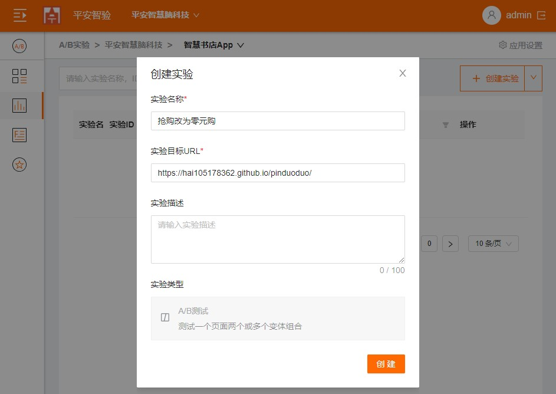
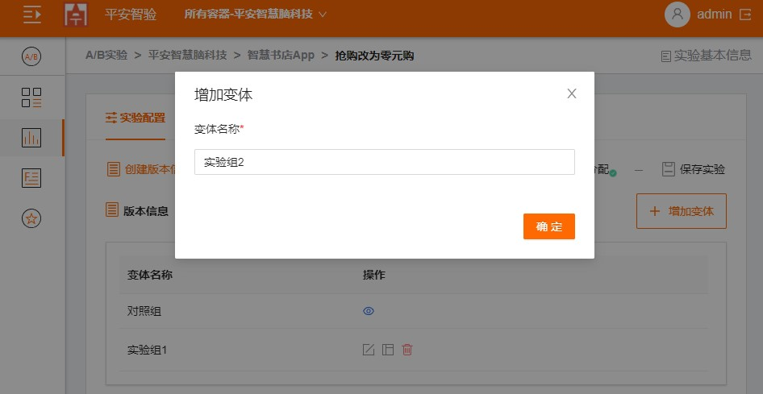

## 可视化创建Web A/B测试

### 步骤1：点击应用名称，然后点击“创建实验”，下拉选择A/B测试

  
  
### 步骤2：填写实验名称，实验网页的URL，填写完成后，点击“创建“。

  
  
### 步骤3：制作网站的变体

    1. 点击“增加变体”。填写变体的名称，然后单击“完成”。
    
    
    
    

    2. 点击“增加变体”。填写变体的名称，然后单击“完成”。
