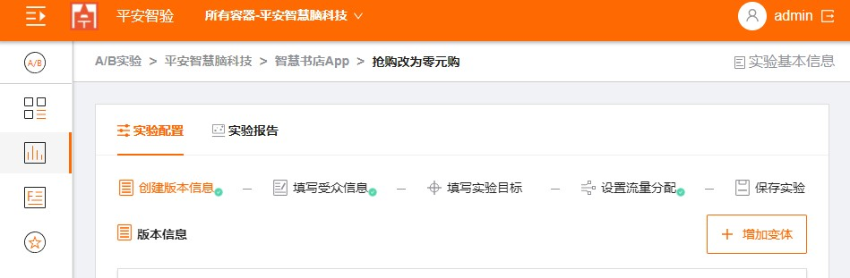
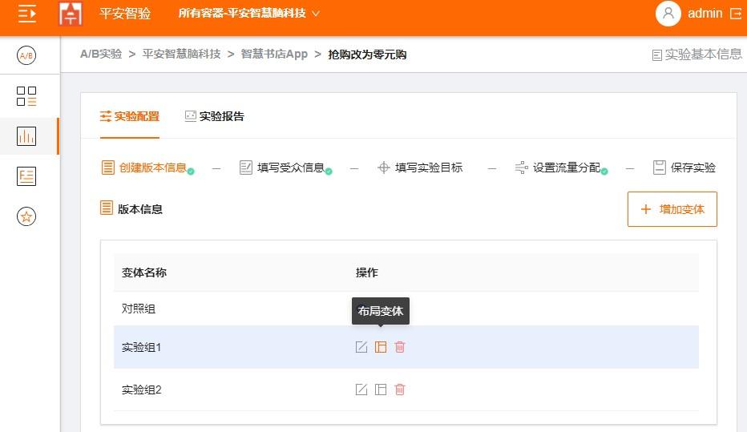

## 可视化创建Web A/B测试

### 步骤1：点击应用名称，然后点击“创建实验”，下拉选择A/B测试

  
  
### 步骤2：填写实验名称，实验网页的URL，填写完成后，点击“创建“。

  
  
### 步骤3：制作网站的变体

   1. 点击“增加变体”。填写变体的名称，然后单击“完成”。
    
   
    
   

   2. 添加变体后，单击“变体布局”。会自动跳到可视编辑器中打开编辑器页面。

   
   
   3. 在编辑器页面更改要素，比如改变照片和字体大小等。
   
   
   
### 步骤4：定位受众群体。

   1. 点击“添加受众规则”。
     
   
     
   2. 选择定位受众的规则，可以从设备，屏幕大小等定位。可以选择多个规则。
     
   

   

### 步骤5：设定实验目标
  
    总共可以设置两类实验目标，主要指标及附加指标，有且只有一个主要指标，附加指标可选最多3个。
    
    1. 点击“添加主要指标”，设置指标名称，设置指标及计算公式;
    
    2. 点击“添加主要指标”，设置指标名称，设置指标及计算公式;
      
    
    
    
