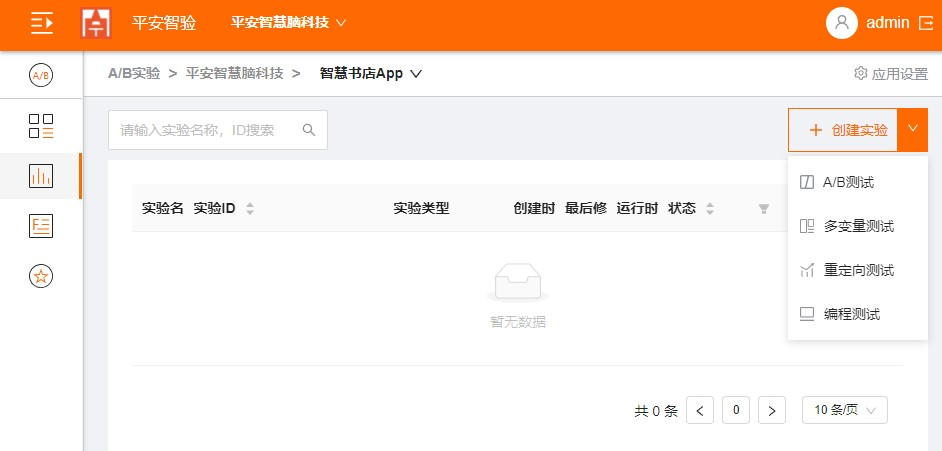
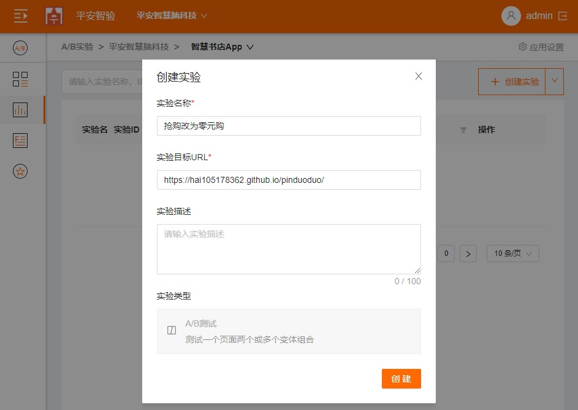
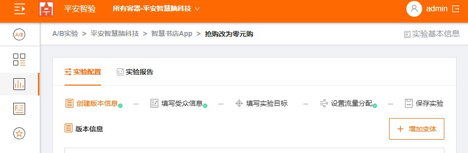
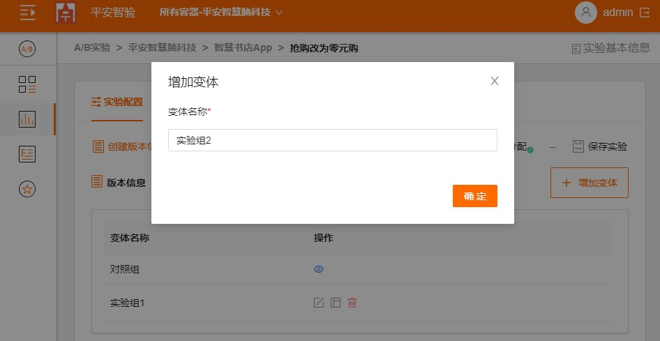
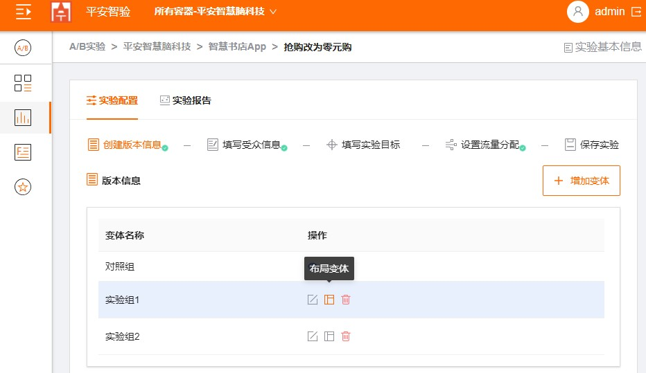
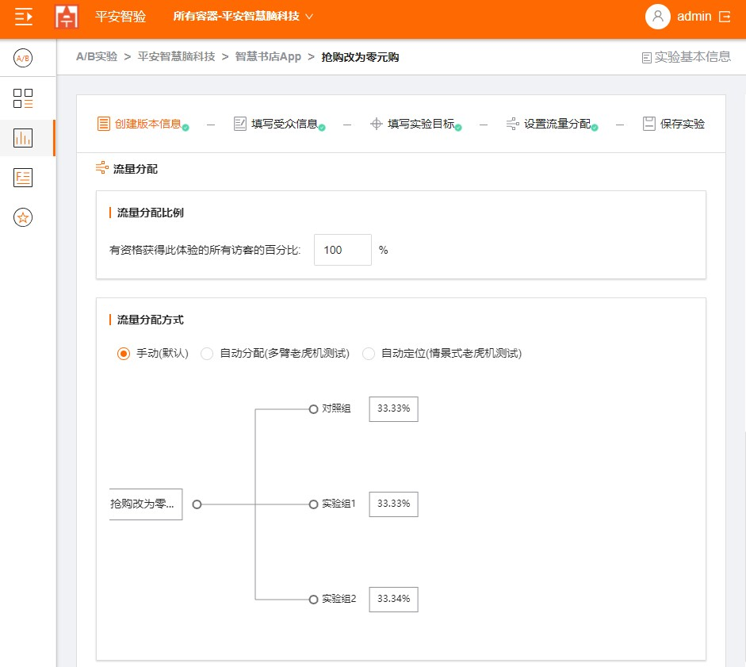
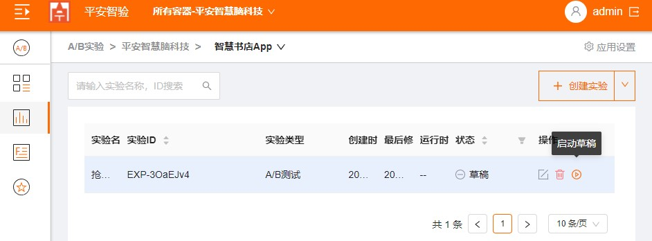

## 可视化创建多变量测试（multivariate test-MVT）

### 步骤1：点击应用名称，然后点击“创建实验”，下拉选择多变量测试

  
  
### 步骤2：填写实验名称，实验网页的URL，填写完成后，点击“创建“。

  
  
### 步骤3：制作网站的变体

   1. 点击“增加Section”。填写板块的名称，然后单击“确定”。

   2. 在板块，点击“增加变体”。填写变体的名称，然后单击“确定”。
    
   
    
   

   3. 添加变体后，单击“变体布局”。会自动跳到可视编辑器中打开编辑器页面。

   
   
   4. 在编辑器页面更改要素，比如改变照片和字体大小等。
   
   
   
   5. 根据需要重复上述步骤。
  
   6. 单击"组合"选项卡以查看要测试的所有组合，可以根据需要预览每个组合，以确保您的页面正确呈现。
   
### 步骤4：定位受众群体。

   1. 点击“添加受众规则”。
     
   
     
   2. 选择定位受众的规则，可以从设备，屏幕大小等定位。可以选择多个规则。
     
   

   

### 步骤5：设定实验目标
    
   1. 点击“添加主要指标”，设置指标名称，设置指标及计算公式;

   
    
   2. 点击“添加主要指标”，设置指标名称，设置指标及计算公式;

   
      
   >  总共可以设置两类实验目标，主要指标及附加指标，有且只有一个主要指标，附加指标可选最多3个。
   >  
### 步骤6：设定实验流量
    
   1. 配置有资格获得此体验的所有访客流量分配比例；
    
   2. 设置流量分配方式，目前支持三种方式手动(默认)、自动分配(多臂老虎机测试)、自动定位(情景式老虎机测试)；
    
   
     
### 步骤7：开启实验

  
  
  
#### 实验运行多长时间？
  1. 至少两周时间
  2. 显著水平达到xxx
    
