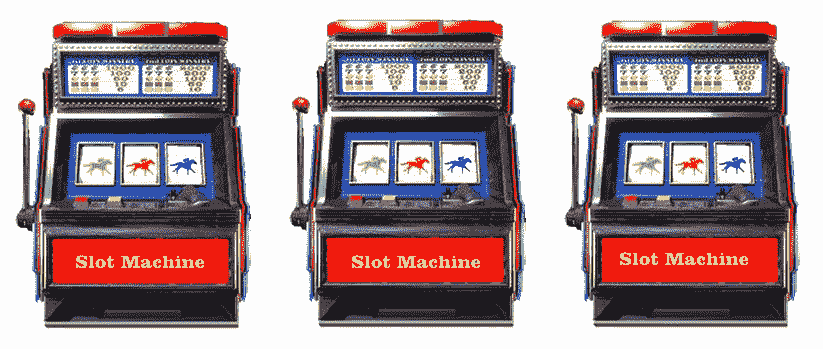
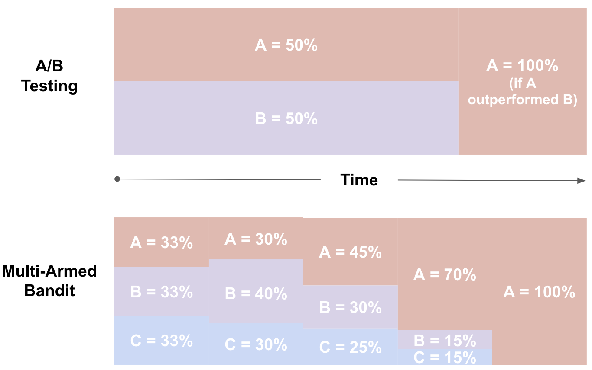

## 多臂老虎机(Multi-armed Bandit)测试

### 多臂老虎机问题

多臂赌博机（Multi-Armed Bandit）据说这个名字的来源是这样的，赌场里的老虎机有一个绰号叫单臂强盗[single-armed bandit]，因为它即使只有一只胳膊，也会把你的钱拿走。所以，当你进入一个赌场，面对一排老虎机，就像面对了一个多臂强盗，而Multi-Armed Bandit就是这样引申而来。假设你进入一个赌场，面对一排老虎机（所以有多个臂），由于不同老虎机的期望收益和期望损失不同，你采取什么老虎机选择策略来保证你的总收益最高呢？这就是经典的**多臂老虎机问题**。

  

### 多臂老虎机(Multi-armed Bandit)测试

多臂老虎机(Multi-armed Bandit)测试是一种A/B测试，它使用机器学习从测试期间收集的数据中学习，动态调整访问者分配到转化率更好的变体。这意味着，随着时间的推移，不好的变体会越来越少地分配流量。MAB的核心概念是"动态流量分配" 。

  
