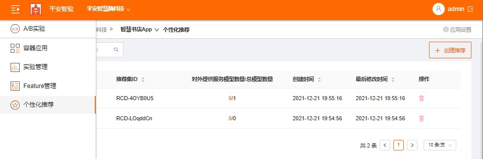
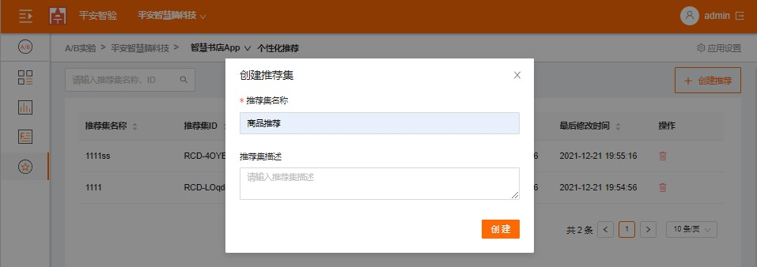
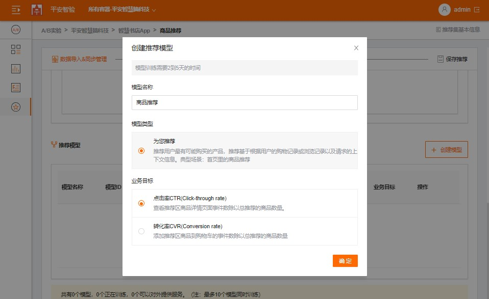
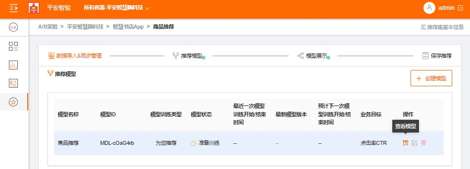
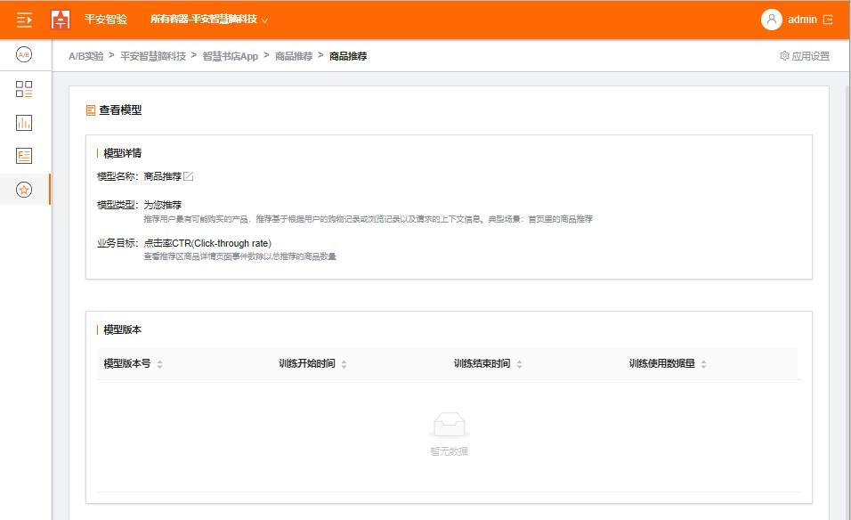
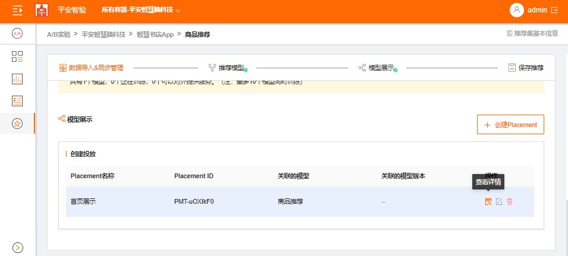
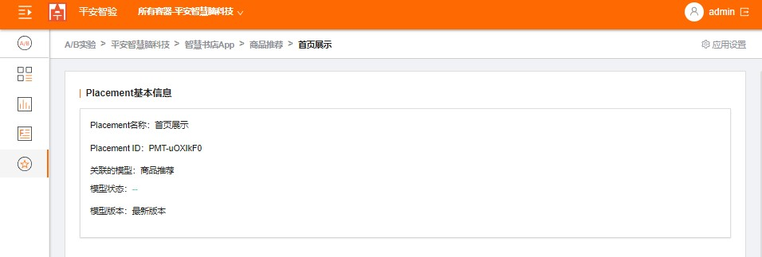
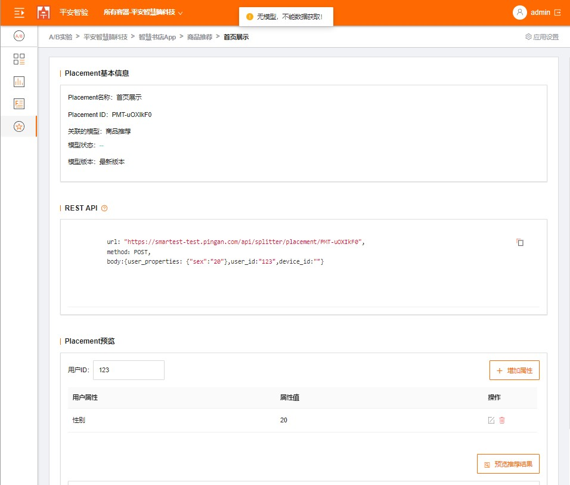

## 个性化推荐

### 步骤1：创建推荐集

   1. 点击左侧导航树"个性化推荐",切换到个性化页面。
   
   
    
   2. 点击"创建推荐"按钮，输入推荐集名称等
   
   

### 步骤2：导入数据
   
   1. 用户数据，存储有关用户的元数据，这可能包括年龄、性别或会员资格等信息。
  
   > 用户数据必须包括USER_ID字段，且至少需要一个元数据字段（如AGE），最多可以添加 5 个元数据字段。导入后自动根据数据识别生成schema，如下，后续将允许用户手动配置。
   
   ```
   {
     "name": "Users",
     "namespace": "com.pingan.gbd.personalize.schema",
     "fields": [
       {
         "name": "USER_ID",
         "type": "string"
       },
       {
         "name": "AGE",
         "type": "int"
       },
       {
         "name": "GENDER",
         "type": "string",
         "categorical": true
       }
     ],
     "version": "1.0"
   }
   
   ```

   2. 商品数据，带推荐的商品。
   
   > 每个商品提供一个商品编号**ITEM_ID**，且至少需要一个元数据字段,您最多可添加 50 个元数据字段。同理，导入后自动根据数据识别生成schema，如下，后续将允许用户手动配置。
   
   ```   
   {
     "name": "Items",
     "namespace": "com.pingan.gbd.personalize.schema",
     "fields": [
       {
         "name": "ITEM_ID",
         "type": "string"
       },
       {
         "name": "BRAND",
         "type": [
           "null",
           "string"
         ],
         "categorical": true
       },
       {
         "name": "MANUFACTUR_DATE",
         "type": "long"
       },
       {
         "name": "DESCRIPTION",
         "type": [
           "null",
           "string"
         ],
         "textual": true
       },
     ],
     "version": "1.0"
   }
   ```
   
   
### 步骤3：创建模型

   1. 点击"创建模型"按钮，输入模型名称、选择模型类型及业务目标；
   
   
    
   2. 点击"查看详情"按钮，可以查看模型信息；
   
   

   
   
### 步骤4: 创建投放

   1. 点击“创建投放”，输入投放名称，选择推荐的模型及版本；
   
   
   
    
   2. 等待模型变为"可供查询",点击"查看详情",可以查看投放是否可用；
   
   
   
   
   
    
   3. 预览推荐，模型准备好后；
    
       3.1 点击"查看详情"，打开投放详情页面；
       
       3.2 输入用户ID及用户属性；
       
       3.3 点击“推荐预览”，即可在页面查看推荐商品列表。
       
       
       

### 步骤5： 实现个性化推荐

   
   1. 如需获取推荐，请向 predict REST 方法发出 POST 请求， PLACEMENT_ID 替换为实际投放的ID，并提供相应的请求正文将：
   ```
   curl -X POST \
    --data  '{
              "use_id": "123",
              "device_id": "e-123",
              "user_properties": {
                "age": "20",
                "sex": "1"
              }
            }' \
   https://smartest-test.pingan.com/api/splitter/placements/PLACEMENT_ID
   
   ```
   
   2. 您应该会看到如下所示的结果：

   ```
   
   {
     "results": [{"id": "sample-id-1"}, {"id": "sample-id-2"}],
     "recommend_id": "sample-recommend_id"
   }
   
   ```
