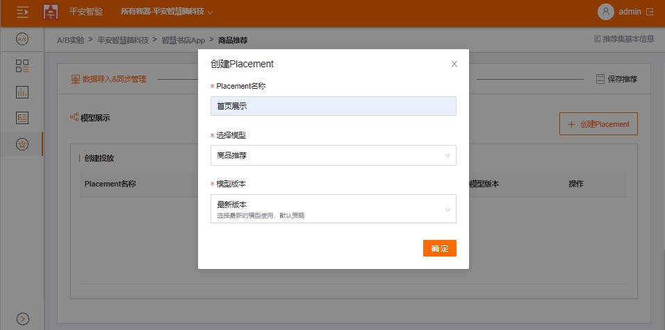

## 个性化推荐

### 步骤1：创建推荐集

   1. 点击左侧导航树"个性化推荐",切换到个性化页面。
   
   
    
   2. 点击"创建推荐"按钮，输入推荐集名称等
   
   

### 步骤2：导入数据


### 步骤3：创建模型

   1. 点击"创建模型"按钮，输入模型名称、选择模型类型及业务目标；
   
   
    
   2. 点击"查看详情"按钮，可以查看模型信息；
   
   

   
   
### 步骤4: 创建投放

   1. 点击“创建投放”，输入投放名称，选择推荐的模型及版本；
   
   
   
    
   2. 等待模型变为"可供查询",点击"查看详情",可以查看投放是否可用；
   
   
   
   
   
    
   3. 预览推荐，模型准备好后；
    
       3.1 点击"查看详情"，打开投放详情页面；
       
       3.2 输入用户ID及用户属性；
       
       3.3 点击“推荐预览”，即可在页面查看推荐商品列表。
       
       
       

### 步骤5： 实现个性化推荐

   
   1. 如需获取推荐，请向 predict REST 方法发出 POST 请求， PLACEMENT_ID 替换为实际投放的ID，并提供相应的请求正文将：
   ```
   curl -X POST \
    --data  '{
              "use_id": "123",
              "device_id": "e-123",
              "user_properties": {
                "age": "20",
                "sex": "1"
              }
            }' \
   https://smartest-test.pingan.com/api/splitter/placements/PLACEMENT_ID
   
   ```
   
   2. 您应该会看到如下所示的结果：

   ```
   
   {
     "results": [{"id": "sample-id-1"}, {"id": "sample-id-2"}],
     "recommend_id": "sample-recommend_id"
   }
   
   ```
