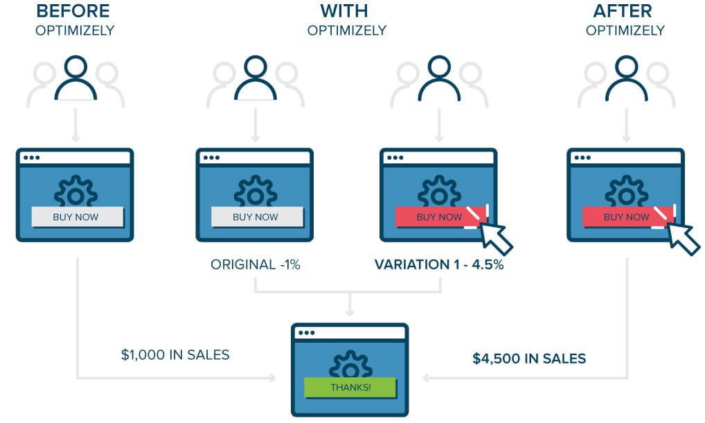
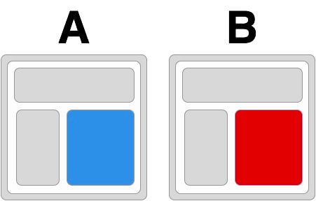
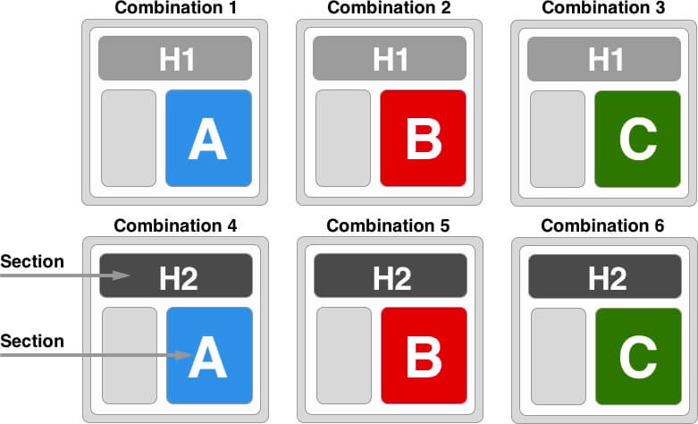
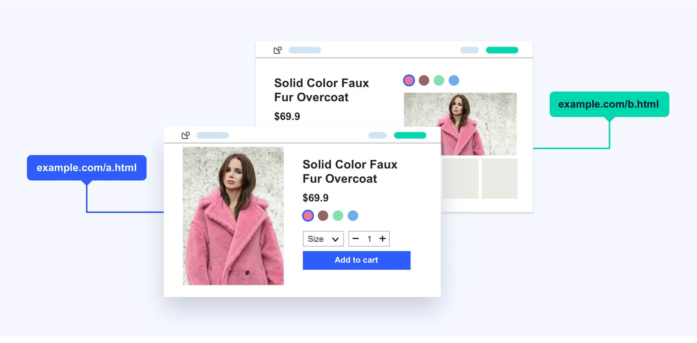

## 什么是AB测试

A/B 测试由一个随机实验组成，其中一个变量的两个变体 A 和 B, 同时显示给不同网站访问者群体，以确定哪个版本的影响最大并推动业务指标。

简单来讲，A/B测试是一种比较手段：通过分析同一总体下，由于某些不同的策略导致样本数据表现出的差异，来推断某些策略的效果。

（关键词：同一总体，策略，不同样本，差异及效果）

## A/B 测试有哪些类型？

### A/B 测试（拆分测试)

A 是原始版本，变体 B 到 n 每个都包含一个或多个从原始元素修改而来的元素（例如，不同颜色的号召性用语按钮）。

A/B 测试（拆分测试)，着重简单的页面元素的测试。

### 多变量测试

两个标题（原始 H1 和变体 H2 ）和三个英雄图像（原始 A 和变体 B 和 C ），产生 6 种组合；

多变量测试，强调组合，分析多元素之间的最佳匹配，减少多个 A/B 测试的需求，提高效率。

### 拆分 URL 测试

拆分 URL 测试，非常适合在使用现有页面设计进行比较分析的同时尝试全新的设计；推荐用于运行非 UI 更改的测试，例如切换到不同的数据库、优化页面的加载时间等；更改网页工作流程，工作流会极大地影响业务转换，有助于在实施更改之前测试新路径并确定是否遗漏了任何症结点。

拆分 URL 测试，是一种更好且备受推荐的动态内容测试方法。

多页面测试

## 如何实施一个 A/B 测试？

A/B 测试在概念上似乎是一个简单的实验过程。然而，事实并非如此。这是一个复杂的过程，需要耐心、坚持和精确。运行 A/B 测试涉及如下几个主要阶段和多个阶段，你的研究、计划和假设发展越彻底，创建的测试就越好，获胜的可能性就越大。
 
### 进行彻底的研究

定量的网站分析工具（比如：天眼 AB Testing），为后续步骤进行可操作的观察。

A/B 测试的评估是基于数据的，所以在做测试之前，一定要先做好数据的收集和分析，该埋点的埋点，该分析的分析。

### 观察并提出假设

分析和理解这些数据，绘制网站和用户画像以制定有数据支持的假设。

### 创建必要的变体

不填表格的人够多？表单是否有太多字段？它会要求提供个人信息吗？也许你可以通过省略要求提供个人信息的字段来尝试使用较短形式的变体或其他变体。

### 运行测试

开始测试并等待规定的时间以获得具有统计意义的结果。

很显然，测试时长对于 A/B 测试非常重要。测试的时长短，会话少，会严重影响测试结果的置信度。测试时长太长的话，会影响产品的迭代速度。

各个工具和平台，推荐的测试时长也有很大的不同，这里推荐一个计算测试时长的工具：https://vwo.com/tools/ab-test-duration-calculator/ 作为参考，但也仅仅作为参考，大家可以根据自己业务特征和经验进行适当调整。

### 分析结果并部署变更

测试的目的是为了通过测试的结果找到最佳的版本。这就涉及一个问题：如何判断实验结果是否可信任？

在行业中，有个置信度（P 值）可以作为参考，大家可以通过 https://vwo.com/tools/ab-test-significance-calculator/ 计算测试结果的 P 值，从而判断此次测试结果是否可信任。
